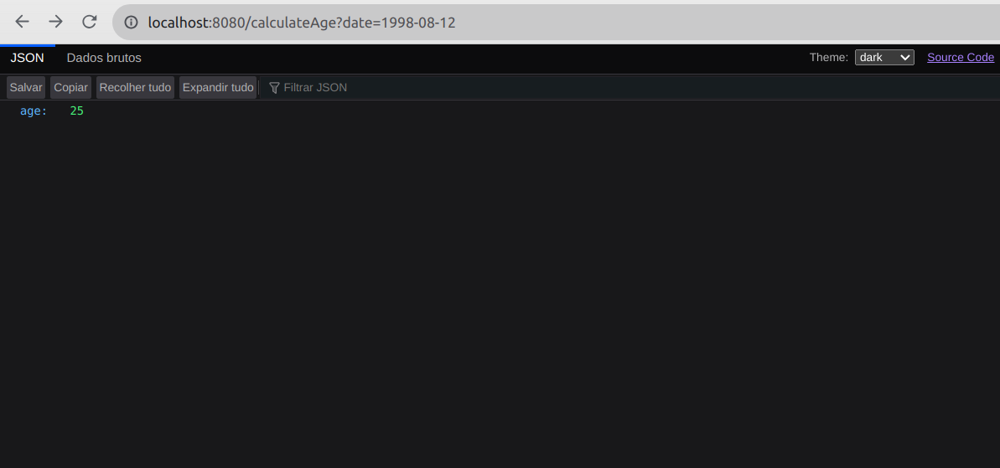
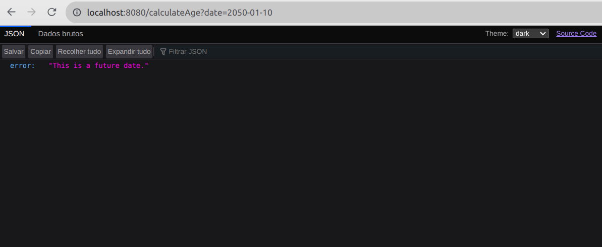

# 📆 🕐 Calculadora de Idade
Neste projeto foi desenvolvido uma API REST em Java utilizando o Spring e aplicando os conceitos como camada de serviço e de controle, DTOs, record e as anotações para mapeamento de rotas. Foram criadas classes customizadas de exceções, validações que lancem exceções e foi utilizado o decorador ExceptionHandler do Spring para gerenciar exceções.

## ⚙️ Instalação das dependências
Para instalar as dependências do projeto, execute o comando `mvn install`. Isso fará o download das dependências configuradas no `pom.xml`, além de baixar as dependências indiretas.

## :white_check_mark: Funcionalidades Implementadas
#### (1) Rota do endpoint GET `/calculateAge?date=aaaa-mm-dd`

#### (2) Implementação do fluxo de exceção para datas futuras com a classe `FutureDateException`

#### (3) Implementação do fluxo de exceção para datas com formato inválido com a classe `InvalidSyntaxDateException`

#### (4) Implementação do fluxo de exceção para datas não numéricas com a classe `NonNumericDateException`

#### (5) Implementação do retorno de um valor padrão para a idade com o query parameter `orDefaultAge` para um endpoint do tipo `/calculateAge?date=XXX&orDefaultAge=0`
 
## 💻 Visualize este projeto:

## 🧹 Linter (Checkstyle)
O Checkstyle é usado para fazer a análise estática do código. Este projeto já vem com as dependências relacionadas ao linter configuradas no arquivo `pom.xml`. Caso deseje rodar o Checkstyle manualmente, basta executar o comando `mvn checkstyle:check`.

## :information_source: Considerações finais
Este projeto é apenas para fins educacionais. Qualquer dúvida ou sugestão, sinta-se à vontade para entrar em contato.
